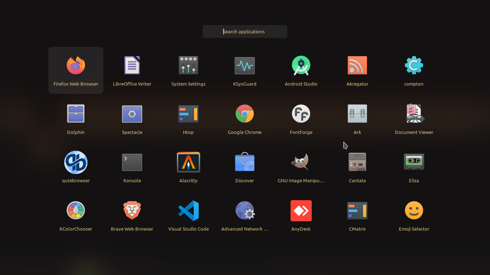
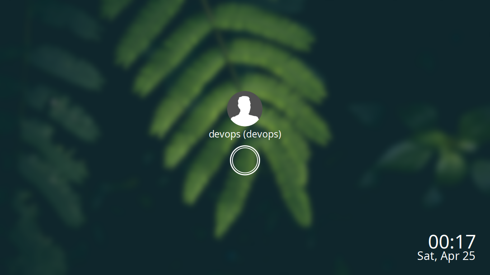

# i3-gaps gruvbox material dark

### Tools used 
- Status bar - [Polybar](https://github.com/polybar/polybar)
- Compositor - [Compton](https://github.com/tryone144/compton)
- Lock screen - [i3lock-color](https://github.com/Raymo111/i3lock-color) and [mantablockscreen](https://github.com/reorr/mantablockscreen)
- Battery popup - [i3-battery-popup](https://github.com/rjekker/i3-battery-popup/blob/master/i3-battery-popup)
- Notification - [Linux Notification Center](https://github.com/phuhl/linux_notification_center)
- USB automount - [udiskie](https://github.com/coldfix/udiskie)
- Application launcher - [Rofi](https://github.com/davatorium/rofi)

Thanks to [Aditya Shakya](https://github.com/adi1090x) for his great looking rofi theme. 
- Rofi theme https://github.com/adi1090x/rofi

